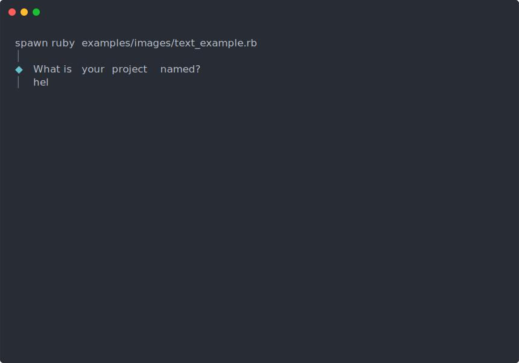
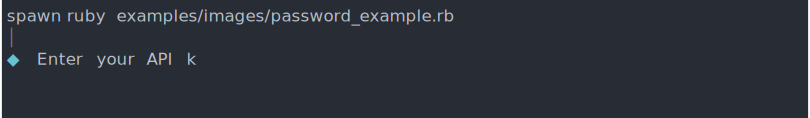
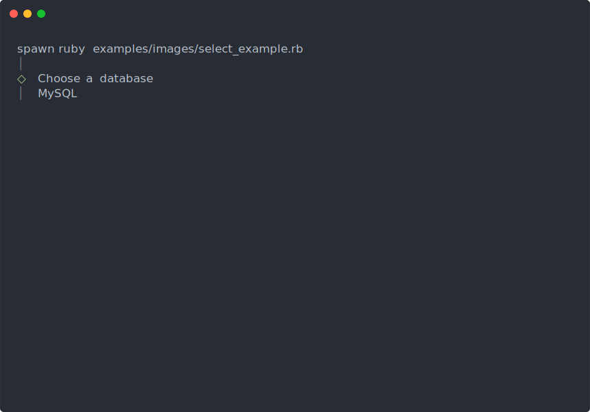
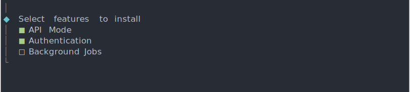
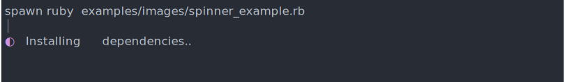

# Clack

**Effortlessly beautiful CLI prompts for Ruby.**

A faithful Ruby port of [@clack/prompts](https://github.com/bombshell-dev/clack).

<p align="center">
  
</p>

## Why Clack?

- **Beautiful by default** - Thoughtfully designed prompts that just look right
- **Vim-friendly** - Navigate with `hjkl` or arrow keys
- **Accessible** - Graceful ASCII fallbacks for limited terminals
- **Composable** - Group prompts together with `Clack.group`

## Installation

```ruby
# Gemfile
gem "clack"

# Or from GitHub
gem "clack", github: "swhitt/clackrb"
```

```bash
# Or install directly
gem install clack
```

## Quick Start

```ruby
require "clack"

Clack.intro "project-setup"

result = Clack.group do |g|
  g.prompt(:name) { Clack.text(message: "Project name?", placeholder: "my-app") }
  g.prompt(:framework) do
    Clack.select(
      message: "Pick a framework",
      options: [
        { value: "rails", label: "Ruby on Rails", hint: "recommended" },
        { value: "sinatra", label: "Sinatra" },
        { value: "roda", label: "Roda" }
      ]
    )
  end
  g.prompt(:features) do
    Clack.multiselect(
      message: "Select features",
      options: %w[api auth admin websockets]
    )
  end
end

if Clack.cancel?(result)
  Clack.cancel("Setup cancelled")
  exit 1
end

Clack.outro "You're all set!"
```

## Demo

Try it yourself:

```bash
ruby examples/full_demo.rb
```

<details>
<summary>Recording the demo GIF</summary>

Requires [asciinema](https://asciinema.org/), [agg](https://github.com/asciinema/agg), and [expect](https://core.tcl-lang.org/expect/index):

```bash
# Record the demo (automated via expect script)
asciinema rec examples/demo.cast --command "expect examples/demo.exp" --overwrite -q

# Split batched frames to show typing (Ruby buffers terminal output)
ruby examples/split_cast.rb

# Convert to GIF
agg examples/demo.cast examples/demo.gif --font-size 18 --cols 80 --rows 28 --speed 0.6
```
</details>

## Prompts

All prompts return the user's input, or `Clack::CANCEL` if they pressed Escape/Ctrl+C.

```ruby
# Check for cancellation
result = Clack.text(message: "Name?")
exit 1 if Clack.cancel?(result)

# Or use handle_cancel for a one-liner that prints "Cancelled" and returns true
result = Clack.text(message: "Name?")
exit 1 if Clack.handle_cancel(result)

# With a custom message
exit 1 if Clack.handle_cancel(result, "Aborted by user")
```

### Validation & Transforms

Prompts support `validate:` and `transform:` options.

```
User Input → Validation (raw) → Transform (if valid) → Final Value
```

Validation returns an error message, a `Clack::Warning`, or `nil` to pass. Transforms normalize the value after validation passes.

**Validation results:**
- `nil` or `false` - passes validation
- String - shows error (red), user must fix input
- `Clack::Warning.new(message)` - shows warning (yellow), user can confirm with Enter or edit

```ruby
# Use symbol shortcuts (preferred)
name = Clack.text(message: "Name?", transform: :strip)
code = Clack.text(message: "Code?", transform: :upcase)

# Chain multiple transforms
username = Clack.text(
  message: "Username?",
  transform: Clack::Transformers.chain(:strip, :downcase)
)

# Combine validation and transform
amount = Clack.text(
  message: "Amount?",
  validate: ->(v) { "Must be a number" unless v.match?(/\A\d+\z/) },
  transform: :to_integer
)

# Warning validation (soft failure, user can confirm or edit)
file = Clack.text(
  message: "Output file?",
  validate: ->(v) { Clack::Warning.new("File exists. Overwrite?") if File.exist?(v) }
)
```

Built-in validators and transformers:

```ruby
# Validators - return error message, Warning, or nil
Clack::Validators.required              # Non-empty input
Clack::Validators.min_length(3)         # Minimum character count
Clack::Validators.max_length(100)       # Maximum character count
Clack::Validators.format(/\A[a-z]+\z/, "Only lowercase")
Clack::Validators.email                 # Email format (user@host.tld)
Clack::Validators.url                   # URL format (http/https)
Clack::Validators.integer               # Integer string ("-5", "42")
Clack::Validators.in_range(1..100)      # Numeric range (parses as int)
Clack::Validators.one_of(%w[a b c])     # Allowlist check
Clack::Validators.path_exists           # File/dir exists on disk
Clack::Validators.directory_exists      # Directory exists on disk
Clack::Validators.future_date           # Date strictly after today
Clack::Validators.past_date             # Date strictly before today
Clack::Validators.date_range(min: d1, max: d2) # Date within range
Clack::Validators.combine(v1, v2)       # First error/warning wins

# Warning validators - allow user to confirm or edit
Clack::Validators.file_exists_warning   # For file overwrite confirmations
Clack::Validators.as_warning(validator) # Convert any validator to warning

# Transformers - normalize the value (use :symbol or Clack::Transformers.name)
:strip / :trim      # Remove leading/trailing whitespace
:downcase / :upcase # Change case
:capitalize         # "hello world" -> "Hello world"
:titlecase          # "hello world" -> "Hello World"
:squish             # Collapse whitespace to single spaces
:compact            # Remove all whitespace
:to_integer         # Parse as integer
:to_float           # Parse as float
:digits_only        # Extract only digits
```

### Text



```ruby
name = Clack.text(
  message: "What is your project named?",
  placeholder: "my-project",       # Shown when empty (dim)
  default_value: "untitled",       # Used if submitted empty
  initial_value: "hello-world",    # Pre-filled, editable
  validate: ->(v) { "Required!" if v.empty? },
  help: "Letters, numbers, and dashes only"  # Contextual help text
)
```

**Tab completion** - press `Tab` to fill the longest common prefix of matching candidates:

```ruby
# Tab completion from a static list
cmd = Clack.text(
  message: "Command?",
  completions: %w[build test deploy lint format]
)

# Dynamic tab completion
file = Clack.text(
  message: "File?",
  completions: ->(input) { Dir.glob("#{input}*") }
)
```

### Password



```ruby
secret = Clack.password(
  message: "Enter your API key",
  mask: "*"  # Default: "▪"
)
```

### Multiline Text

Multi-line text input. Enter inserts a newline, Ctrl+D submits.

```ruby
bio = Clack.multiline_text(
  message: "Tell us about yourself",
  initial_value: "Hello!\n",
  validate: ->(v) { "Too short" if v.strip.length < 10 }
)
```

### Confirm


```ruby
proceed = Clack.confirm(
  message: "Deploy to production?",
  active: "Yes, ship it!",
  inactive: "No, abort",
  initial_value: false
)
```

### Select

Single selection with keyboard navigation.



```ruby
db = Clack.select(
  message: "Choose a database",
  options: [
    { value: "pg", label: "PostgreSQL", hint: "recommended" },
    { value: "mysql", label: "MySQL" },
    { value: "sqlite", label: "SQLite", disabled: true }
  ],
  initial_value: "pg",
  max_items: 5  # Enable scrolling
)
```

### Multiselect

Multiple selections with toggle controls.



```ruby
features = Clack.multiselect(
  message: "Select features to install",
  options: [
    { value: "api", label: "API Mode" },
    { value: "auth", label: "Authentication" },
    { value: "jobs", label: "Background Jobs" }
  ],
  initial_values: ["api"],
  required: true,     # Must select at least one
  max_items: 5        # Enable scrolling
)
```

**Shortcuts:** `Space` toggle | `a` all | `i` invert

### Autocomplete

Type to filter from a list of options. Filtering uses **fuzzy matching** by default -- characters must appear in order but don't need to be consecutive (e.g. "fb" matches "foobar"). Pass `filter:` to override with custom logic.

```ruby
color = Clack.autocomplete(
  message: "Pick a color",
  options: %w[red orange yellow green blue indigo violet],
  placeholder: "Type to search..."
)

# Custom filter logic (receives option hash and query string)
cmd = Clack.autocomplete(
  message: "Select command",
  options: commands,
  filter: ->(opt, query) { opt[:label].start_with?(query) }
)
```

### Autocomplete Multiselect

Type to filter with multi-selection support.

```ruby
colors = Clack.autocomplete_multiselect(
  message: "Pick colors",
  options: %w[red orange yellow green blue indigo violet],
  placeholder: "Type to filter...",
  required: true,              # At least one selection required
  initial_values: ["red"]      # Pre-selected values
)
```

**Shortcuts:** `Space` toggle | `Enter` confirm

### Path

File/directory path selector with filesystem navigation.

```ruby
project_dir = Clack.path(
  message: "Where should we create your project?",
  only_directories: true,  # Only show directories
  root: "."               # Starting directory
)
```

**Navigation:** Type to filter | `Tab` to autocomplete | `↑↓` to select

### Date

Segmented date picker with three format modes.

```ruby
date = Clack.date(
  message: "Release date?",
  format: :us,                        # :iso (YYYY-MM-DD), :us (MM/DD/YYYY), :eu (DD/MM/YYYY)
  initial_value: Date.today + 7,
  min: Date.today,
  max: Date.today + 365,
  validate: ->(d) { "Not a Friday" unless d.friday? }
)
```

**Navigation:** `Tab`/`←→` between segments | `↑↓` adjust value | type digits directly

### Range

Numeric selection with a visual slider track. Navigate with `←→` or `↑↓` arrow keys (or `hjkl`).

```ruby
volume = Clack.range(
  message: "Set volume",
  min: 0,
  max: 100,
  step: 5,
  initial_value: 50
)
```

### Select Key

Quick selection using keyboard shortcuts.

```ruby
action = Clack.select_key(
  message: "What would you like to do?",
  options: [
    { value: "create", label: "Create new project", key: "c" },
    { value: "open", label: "Open existing", key: "o" },
    { value: "quit", label: "Quit", key: "q" }
  ]
)
```

### Spinner

Non-blocking animated indicator for async work.



```ruby
spinner = Clack.spinner
spinner.start("Installing dependencies...")

# Do your work...
sleep 2

spinner.stop("Dependencies installed!")
# Or: spinner.error("Installation failed")
# Or: spinner.cancel("Cancelled")
```

**Block form** - wraps a block with automatic success/error handling:

```ruby
result = Clack.spin("Installing dependencies...") { system("npm install") }

# With custom messages
Clack.spin("Compiling...", success: "Build complete!") { build_project }

# Access the spinner inside the block
Clack.spin("Working...") do |s|
  s.message "Step 1..."
  do_step_1
  s.message "Step 2..."
  do_step_2
end
```

### Progress

Visual progress bar for measurable operations.

```ruby
progress = Clack.progress(total: 100, message: "Downloading...")
progress.start

files.each_with_index do |file, i|
  download(file)
  progress.update(i + 1)
end

progress.stop("Download complete!")
```

### Tasks

Run multiple tasks with status indicators.

```ruby
results = Clack.tasks(tasks: [
  { title: "Checking dependencies", task: -> { check_deps } },
  { title: "Building project", task: -> { build } },
  { title: "Running tests", task: -> { run_tests } }
])

# Update the spinner message mid-task
Clack.tasks(tasks: [
  { title: "Installing", task: ->(message) {
    message.call("Fetching packages...")
    fetch_packages
    message.call("Compiling...")
    compile
  }}
])

# Conditionally skip tasks with enabled:
Clack.tasks(tasks: [
  { title: "Lint", task: -> { lint } },
  { title: "Deploy", task: -> { deploy }, enabled: ENV["DEPLOY"] == "true" }
])
```

### Group Multiselect

Multiselect with options organized into groups.

```ruby
features = Clack.group_multiselect(
  message: "Select features",
  options: [
    {
      label: "Frontend",
      options: [
        { value: "hotwire", label: "Hotwire" },
        { value: "stimulus", label: "Stimulus" }
      ]
    },
    {
      label: "Background",
      options: [
        { value: "sidekiq", label: "Sidekiq" },
        { value: "solid_queue", label: "Solid Queue" }
      ]
    }
  ],
  selectable_groups: true,  # Toggle all options in a group at once
  group_spacing: 1          # Blank lines between groups
)
```

## Prompt Groups

Chain multiple prompts and collect results in a hash. Cancellation is handled automatically.

```ruby
result = Clack.group do |g|
  g.prompt(:name) { Clack.text(message: "Your name?") }
  g.prompt(:email) { Clack.text(message: "Your email?") }
  g.prompt(:confirm) { |r| Clack.confirm(message: "Create account for #{r[:email]}?") }
end

return if Clack.cancel?(result)

puts "Welcome, #{result[:name]}!"
```

Handle cancellation with a callback:

```ruby
Clack.group(on_cancel: ->(r) { cleanup(r) }) do |g|
  # prompts...
end
```

## Logging

Beautiful, consistent log messages.

```ruby
Clack.log.info("Starting build...")
Clack.log.success("Build completed!")
Clack.log.warn("Cache is stale")
Clack.log.error("Build failed")
Clack.log.step("Running migrations")
Clack.log.message("Custom message")
```

### Stream

Stream output from iterables, enumerables, or shell commands:

```ruby
# Stream from an array or enumerable
Clack.stream.info(["Line 1", "Line 2", "Line 3"])
Clack.stream.step(["Step 1", "Step 2", "Step 3"])

# Stream from a shell command (returns true/false for success)
success = Clack.stream.command("npm install", type: :info)

# Stream from any IO or StringIO
Clack.stream.success(io_stream)
```

## Note

Display important information in a box.

```ruby
Clack.note(<<~MSG, title: "Next Steps")
  cd my-project
  bundle install
  bin/rails server
MSG
```

### Box

Render a customizable bordered box.

```ruby
Clack.box("Hello, World!", title: "Greeting")

# With options
Clack.box(
  "Centered content",
  title: "My Box",
  content_align: :center,    # :left, :center, :right
  title_align: :center,
  width: 40,                 # or :auto to fit content
  rounded: true              # rounded or square corners
)
```

### Task Log

Streaming log that clears on success and shows full output on failure. Useful for build output.

```ruby
tl = Clack.task_log(title: "Building...", limit: 10)

tl.message("Compiling file 1...")
tl.message("Compiling file 2...")

# On success: clears the log
tl.success("Build complete!")

# On error: keeps the log visible
# tl.error("Build failed!")
```

## Session Markers

```ruby
Clack.intro("my-cli v1.0")  # ┌ my-cli v1.0
# ... your prompts ...
Clack.outro("Done!")        # └ Done!

# Or on error:
Clack.cancel("Aborted")     # └ Aborted (red)
```

## Configuration

Customize key bindings and display options globally:

```ruby
# Add custom key bindings (merged with defaults)
Clack.update_settings(aliases: { "y" => :enter, "n" => :cancel })

# Disable guide bars
Clack.update_settings(with_guide: false)

# CI / non-interactive mode (prompts auto-submit with defaults)
Clack.update_settings(ci_mode: true)       # Always on
Clack.update_settings(ci_mode: :auto)      # Auto-detect (non-TTY or CI env vars)
```

When CI mode is active, prompts immediately submit with their default values instead of waiting for input. Useful for CI pipelines and scripted environments where stdin is not a TTY.

Clack also warns when terminal width is below 40 columns, since prompts may not render cleanly in very narrow terminals.

## Testing

Clack ships with first-class test helpers. Require `clack/testing` explicitly (it is not auto-loaded):

```ruby
require "clack/testing"

# Simulate a text prompt
result = Clack::Testing.simulate(Clack.method(:text), message: "Name?") do |prompt|
  prompt.type("Alice")
  prompt.submit
end
# => "Alice"

# Capture rendered output alongside the result
result, output = Clack::Testing.simulate_with_output(Clack.method(:confirm), message: "Sure?") do |prompt|
  prompt.left   # switch to "No"
  prompt.submit
end
```

The `PromptDriver` yielded to the block provides these methods:

| Method | Description |
|---|---|
| `type(text)` | Type a string character by character |
| `submit` | Press Enter |
| `cancel` | Press Escape |
| `up` / `down` / `left` / `right` | Arrow keys |
| `toggle` | Press Space (for multiselect) |
| `tab` | Press Tab |
| `backspace` | Press Backspace |
| `ctrl_d` | Press Ctrl+D (submit multiline text) |
| `key(sym_or_char)` | Press an arbitrary key by symbol (e.g. `:escape`) or raw character |

## Requirements

- Ruby 3.2+
- No runtime dependencies

## Development

```bash
bundle install
bundle exec rake        # Lint + tests
bundle exec rake spec   # Tests only
COVERAGE=true bundle exec rake spec  # With coverage
```

## Roadmap

- **Wizard mode** - Multi-step flows with back navigation (`Clack.wizard`). The current `Clack.group` runs prompts as sequential Ruby code, so there's no way to "go back" and re-answer a previous question. A declarative wizard API would define steps as a graph with branching and let the engine handle forward/back navigation.

## Credits

This is a Ruby port of [Clack](https://github.com/bombshell-dev/clack), created by [Nate Moore](https://github.com/natemoo-re) and the [Astro](https://astro.build) team.

## License

MIT - See [LICENSE](LICENSE)
